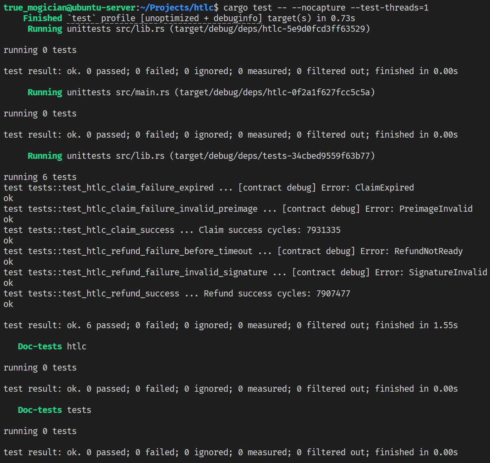

# 双哈希锁超时退回合约 (HTLC)

该合约实现了一个双哈希锁超时退回的功能，允许用户在满足特定条件下进行资产的转移和退回。

## 数据结构

### Cell 数据结构

HTLC 合约使用 CKB Cell 的 lock script 参数（args）存储以下信息：

1. **支付人公钥哈希**：20字节，用于验证退款交易的签名
2. **收款人公钥哈希**：20字节，用于验证解锁交易的签名
3. **哈希锁1**：32字节，第一个哈希锁，需要正确的 preimage 解锁
4. **哈希锁2**：32字节，第二个哈希锁，需要正确的 preimage 解锁
5. **超时时间**：8字节，指定区块高度的 since 值，达到后支付人可退回资金

总计：112字节（20 + 20 + 32 + 32 + 8）

### Witness 数据结构

根据不同的交易类型，HTLC 合约支持两种格式的 witness：

1. **解锁交易 (Claim)**：
   - 收款人签名：65字节（r,s,v 格式的 ECDSA 签名）
   - 原像1：32字节，对应哈希锁1的原像
   - 原像2：32字节，对应哈希锁2的原像

   总计：129字节（65 + 32 + 32）

2. **退款交易 (Refund)**：
   - 支付人签名：65字节（r,s,v 格式的 ECDSA 签名）

※ 起初为了灵活性考虑将解锁交易的原像设计为可变长度（1字节的长度前缀 + 原像数据）。但后来意识到这可能会有原像太短被暴力破解或者过长超出 witness 限制的问题，因此改为固定32字节长度。

## 合约逻辑（[main.rs](../contracts/htlc/src/main.rs)）

1. **解析脚本参数**
	合约首先会通过 `load_script` 函数获取当前 Cell 的 lock script 并获取 args。之后根据协议中的数据结构将其解析为 `ScriptArgs` 结构体。如果长度或者格式不符合协议，返回 `Error::ArgsInvalid`, `Error::SinceInvalid` 或 `Error::WrongSinceFormat` 错误。
2. **解析 witness 参数**
	合约通过 `load_witness_args` 函数获取当前交易的 witness 数据，并根据 witness 的长度判断是解锁交易（`Action::Claim`）还是退款交易（`Action::Refund`）并解析相应参数。如果 witness 长度不符合协议结构，返回 `Error::WitnessInvalid` 错误。
3. **执行验证逻辑**
	合约根据交易类型进行相应的验证：

  	**解锁交易 (Claim)**：
	 - 验证当前区块高度必须小于脚本参数的 since 值
	 - 计算提供的两个原像的哈希值，并与脚本参数中的哈希锁进行比较
	 - 验证收款人的签名是否有效

   	**退款交易 (Refund)**：
	 - 验证当前区块高度必须大于等于脚本参数的 since 值
	 - 验证支付人的签名是否有效

- **since 验证**
	根据 Nervos CKB 的[官方文档](https://github.com/nervosnetwork/rfcs/blob/master/rfcs/0017-tx-valid-since/0017-tx-valid-since.md)，since 字段可以是绝对值也可以是相对值，同时支持 block number，epoch number 和 timestamp 三种格式。由于 lock script 无法像 EVM 的 smart contract 一样直接获取当前区块的高度，因此想要验证时间必须使用绝对的 since 值。至于格式，block number 和 timestamp 的 value 都可以直接进行比较，因此本合约中都支持；epoch number 相对复杂，暂未支持。
	解析 since 值时，如果格式错误（reserved 位非 0 或者 metric 位为 3），返回 `Error::SinceInvalid` 错误。
	比较 since 值时，两个算子需要都是绝对值、类型相同且类型不为 epoch number，否则返回 `Error::WrongSinceFormat` 错误。

- **签名验证**
	签名验证使用 CKB 标准中的 blake2b256 + secp256k1 签名方案。具体而言，合约会首先会利用脚本参数中的 signature 构造 secp256k1 的签名，之后通过 `load_tx_hash` 函数获取当前交易的 hash，然后使用 `VerifyingKey::recover_from_prehash` 函数恢复公钥，最后对比恢复的公钥哈希和脚本参数中的公钥哈希是否一致。如果不一致，返回 `Error::SignatureInvalid` 错误。

## 交易构造流程（[tests.rs](../tests/src/tests.rs)）

### 交易准备

1. 生成支付人和收款人的密钥对
2. 生成两个随机 preimage 及其对应的哈希
3. 确定超时区块高度（since 值）
4. 构建 Cell 的 lock script，将上述数据编码进 args
5. 创建输出 Cell，锁定 CKB 资产

### 解锁 (Claim) 交易

1. 构建输入，引用 HTLC Cell
2. 构建输出，指向收款人的地址
3. 收款人签名交易
4. 构建 witness 数据：收款人签名 + preimage1 + preimage2
5. 提交交易

### 退款 (Refund) 交易

1. 构建输入，引用 HTLC Cell，设置 since 参数不小于锁定时间
2. 构建输出，指向支付人的地址
3. 支付人签名交易
4. 构建 witness 数据：仅包含支付人签名
5. 提交交易

## 测试结果

### 测试样例

1. **解锁成功**：收款人提供正确的两个 preimage 和有效签名
2. **退款成功**：支付人在超时后提供有效签名
3. **解锁失败 - 错误的 preimage**：收款人提供无效的 preimage
4. **解锁失败 - 已过期**：收款人在超时后尝试解锁
5. **退款失败 - 未到期**：支付人在超时前尝试退款
6. **退款失败 - 无效签名**：使用错误的密钥签名退款交易

### 运行截图

由于未能找到合适的方法在失败场景中直接验证返回的是预期的错误码，我在合约代码中通过 `debug` 宏进行了输出，可以在截图中看到对应的错误信息，它们都和预期结果一致。

### 其他
- Nervos CKB 的 Cell 模型（以及 BTC 的 UTXO 模型）和 EVM 的 Account 可以说是完全不同，根本就是两种架构和思维方式，熟悉适应 CKB 这套模型确实费了点功夫。
- 理解了 Cell 模型后，其实这个任务的算法和逻辑就很清晰了，伪代码的话其实就几行的事。但 CKB 的开发环境配置是真让人头疼，以及熟悉这套框架也是个调整，毕竟这不仅是我做的第一个 CKB 相关的项目，也是第一次用 Rust 些项目。整体算下来至少有 3/4 的时间都花在配置和调试环境上了。
- `ckb-hash` 里那个 `ckb-contract` 特性的坑是真离谱，文档文档没有，报错显示的还是 `blake2b-rs` 找不到 `string.h`，搞得我以为是环境问题，来来回回查资料问 LLM 折腾了好几个小时，直接梦回当年做 C++ 开发时对着上千行的 template 报错无所适从的时候，最后没办法都尝试用 docker 镜像了也没解决（确实也解决不了，毕竟根本就不是环境的问题），到头来还是咨询的于桐才终于整明白。这种已知的、经常出现的而且报错非常无厘头的问题官方就算不妥善解决也有责任在文档中注明，就在代码库的 `Cargo.toml` 里加了一行注释这谁找得到，更何况这报错信息根本都定位不到 `ckb-hash` 这个 crate ……
- 由于没注意到合约开发是 no_std 环境，一开始用了一个依赖 std 的 crate (`secp256k1`)，也报了一堆错，好在这个报错信息还算可以理解，换成纯 Rust 的 `k256` 后就没问题了。